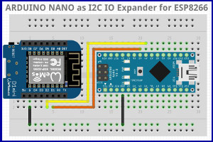

++++++++++++++++++++++++++++++++++++++++++++
User documentation of nanoI2CSlaveExpander
++++++++++++++++++++++++++++++++++++++++++++

.. contents:: Table of Contents
.. section-numbering::

=======================================
Install
=======================================

Flash the code provided in the following dir in an ARDUINO Nano: 

.. code:: 

    02-realisation\01-software\nanoI2CIOExpander

Do connections provided below.

Install the followinf provided lib in the ARDUINO IDE :

.. code:: 

    02-realisation\01-software\nanoI2CIOExpLib

See `on arduino.cc`_ the procédure to manualy install the lib.

.. _`on arduino.cc` : https://www.arduino.cc/en/guide/libraries

Run examples in the ESP8266 or in other ARDUINO (2560, UNO or an other Nano)

=======================================
Connections
=======================================

Connect ARDUINO nano pin A4 I2C SDA to SDA pin of your choosed master (Wemos D1 mini pin D2)

Connect ARDUINO nano pin A5 I2C SCL to SCL pin of your choosed master (Wemos D1 mini pin D1)

Dont forget the ground between the board !

Normally I2C bus require some pull-up resitor to VCC abbout 4.7k. For me it works without !

I verified Nano v3 schematics, i haven't seen them; nor on the Wemos. Perhaps somme internal pu ?

Now with ARDUINO pin D2 to D9 you can drive LED or input button or drive relay or power mos transitor...

And more inpurtant, you added 6 analog inputs to your system (Wemos D1) to read voltage level
from analog sensor for example.

=======================================
Run example
=======================================

Choose from ARDUINO IDE, one of the provided examples : 

analogRead, blink or flasher and download it to your target (Wemos for example)

=======================================
Lib API
=======================================

There is 2 class provided :

- CNanoI2CIOExpander with pinMode, digitalRead, digitalWrite and nalogRead methods
- CFlasherNanoExp that you can use to creat LEDs flasher

For more informations on software provided don't forget to read `Doxygen generated documentation`_.

.. _`Doxygen generated documentation` : https://majorlee95.github.io/nanoI2CIOExpander

=======================================
Other usefull informations
=======================================   

ARDUINO lib
====================================

ARDUINO lib to use nanoI2CIOExpander.

In dir:
\projet\02-realisation\01-software

name : nanoI2CIOExpLib

Class name : CNanoI2CIOExpander 

Provided method:

- void begin( I2C_ADD default = 0x5F )
- void pinMode( pin = 0 to 7 )
- void digitalWrite( pin, STATE ) : STATE = LOW or HIGH, PIn 0 to 7
- int digitalRead( pin )
- int analogRead( A0 to A7 ) : warning there is diff with ARDUINO pin A0 to A3 and A6, A7

A4 A5 excluded return 0

Test program
====================================

dev of i2CMasterForTest.ino

in :

050-nanoI2CSlaveExpander\projet\11-outils\i2CMasterForTest

Passed tests
==================

R/W from to registers : ok

<R5f 5>

digital inputs : D3, D4 D5 D5 D6 D7 D8 D9

<W5F 7 fe>

inputs pullup : ok

digital outputs : D2(0) ok

analog input A0 75mV error on 1V and 218mV @2.5V, 326mV @4V

analog globaly tested but not fully A1 ok, A2 ok with about the same error

Address bits D10..D12 ok @58,59, 5C and 5e tested

I2C address
============================

Choosed add, in config.h
============================
0x5F 

Base address is 0x58 ored with pin state D12..D10, @1 by default

Register MAP
============================

For last up today, see Doxygen source documentation of MAXREG macro in the config.h file.

- 0x00 : Major version (RO)
- 0x01 : R/W test reg 1
- 0x02 : R/W test reg 2
- 0x03 : 0x55 (RO)
- 0x04 : DDR (R/W) 1 for output, default 0
- 0x05 : digital DATA (R/W) a write on input bit has no effect
- 0x06 : Minor version (RO)
- 0x07 : puulup reg (R/W) : 1 pullup is enable, default = 0
- 0x08 to 0x0F : reserved (read data 0xA5)

- 0x10, 0x11 : A0 low, high (RO)
- 0x12, 0x13 : A1 low, high (RO)
- 0x14, 0x15 : A2 low, high (RO)
- 0x16, 0x17 : A3 low, high (RO)
- 0x18, 0x19 : 0xCA low, 0xFE high (RO)
- 0x1A, 0x1B : 0xFE low, 0xCA high (RO)
- 0x1C, 0x1D : A6 low, high (RO)
- 0x1E, 0x1F : A7 low, high (RO)

RO : Read Only
R/W : Read and Write enabled registers

Writable registers are : 1,2,4,5 and 7

Pining
============================

- D0-D1 :<=> RX-TX for download and debug
- D2..D9 : 8 digital IO
- D10..D12 : I2C low address bits (default 1 with internal pullup)
- D13 bultin LED
- A4-A5 I2C pin
- A0-A3 : 4 analog inputs
- A6-A7 : 2 analog inouts

########

.. include:: ../../VoLAB.rst
   :encoding: UTF-8

=============
Webographie
=============

.. target-notes::