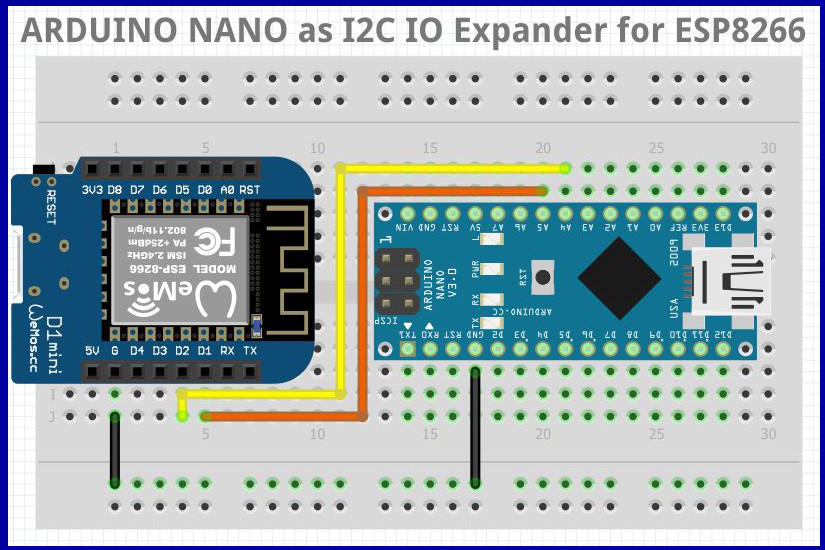

==============================================
General informations for nanoI2CSlaveExpander
==============================================

Picture made with `Fritzing`_

.. _`Fritzing` : http://fritzing.org/home/

:Autor:                MajorLee
:Site_Web:             https://www.volab.org
:Project:              IoT_EPS
:Version:              190115
:GitHub repo:          https://github.com/MajorLee95/nanoI2CIOExpander
:Source doc:           https://majorlee95.github.io/nanoI2CIOExpander
:User doc:             https://github.com/MajorLee95/nanoI2CIOExpander/tree/master/01-docs/01-userDoc
:Conception doc:       https://github.com/MajorLee95/nanoI2CIOExpander/tree/master/01-docs/03-conception
:Licence:              CC0
:Lic link:             https://creativecommons.org/publicdomain/zero/1.0/deed.en

####

Description
============

Use ARDUINO Nano as I2C Slave IO Digital and analog expander for ESP8266 or ESP32 for example

This project contains the code for the ARDUINO Nano and an ARDUINO library to use.

It also contains a Flasher class to flash LED connected to the nanoExpander...

Use it and share it ;-)

Please refere to `User documentation`_

.. _`User documentation` : https://github.com/MajorLee95/nanoI2CIOExpander/tree/master/01-docs/01-userDoc

Enjoy

####

Project tree
=======================

.. code::

    \01-docs\01-userDoc     # User documentation 
    \01-docs\03-conceptionDoc # Conception documentation provide as is (sory there is somme little peaces in French)
    \02-realisation\01-software\nanoI2CIOExpander # source codes to upload in ARDUINO Nano
    \02-realisation\01-software\nanoI2CIOExpLib # The library to use it
    
    
    
    
    
    
    
    
    
    